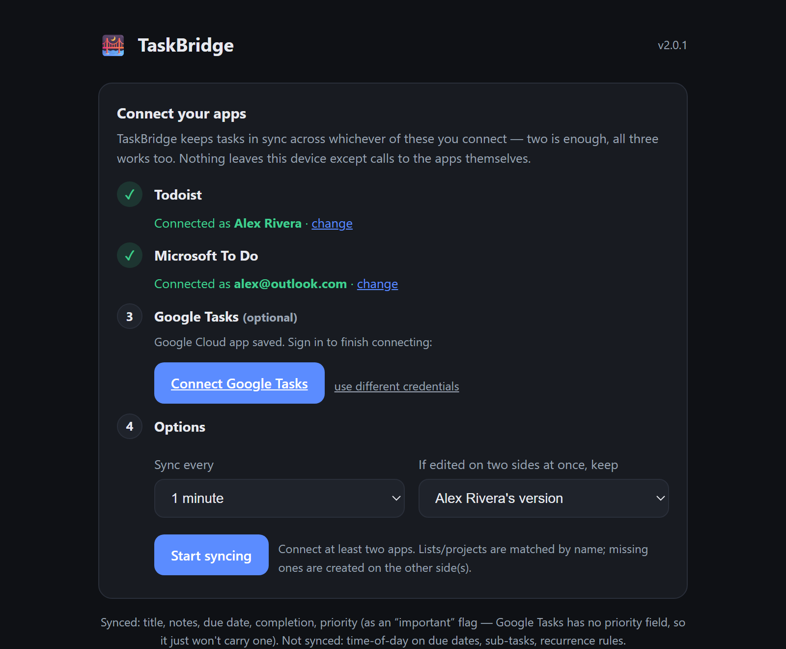

# 🌉 TaskBridge

Two-way sync between **Microsoft To Do** and **Todoist**. Add or check off a task
in either app and it appears in the other within a minute. Runs as a small
self-hosted service — an Umbrel app, or any Docker host.

<p align="center"></p>

## What syncs

| | |
|---|---|
| Title, notes, due **date**, completion | ✅ both ways |
| Priority | ✅ as an "important" flag (Todoist P1/P2 ⇄ To Do High importance) |
| Lists ⇄ Projects | ✅ matched by name; the missing side is created once. Todoist **Inbox** ⇄ To Do **Tasks**. |
| Deleting a task | ✅ deletes its twin |

**Not synced:** time-of-day on due dates (only the date), sub-tasks / checklist
items, recurrence *rules* (a recurring task still syncs its next due date),
labels, reminders, attachments.

**Conflicts** (same task edited on both sides between syncs): Todoist wins by
default — switch to To Do in Settings.

## Install on Umbrel

1. Umbrel → **App Store** → **⋯** (top right) → **Community App Stores** → add:
   ```
   https://github.com/payam-ghavi/taskbridge
   ```
2. Open the **TaskBridge** store, install the app, open it.
3. **Setup** (~1 min):
   - **Todoist:** paste an API token (Todoist → Settings → Integrations → Developer).
   - **Microsoft:** click Connect, open the link, enter the short code, sign in.
     No Azure account or app registration needed — it uses Microsoft's public
     "Graph Command Line Tools" client via the device-code flow.
   - Pick a sync interval and hit **Start syncing**.

## Run with plain Docker

```bash
docker run -d --name taskbridge --restart unless-stopped \
  -p 3737:3737 -v taskbridge-data:/data \
  ghcr.io/payam-ghavi/taskbridge:latest
```

Open `http://localhost:3737` and complete setup.

## How it works

Every cycle it pulls Todoist's incremental feed (`sync_token`) and each To Do
list's Graph delta query (Microsoft has no webhooks for To Do), reconciles both
against a local SQLite state file, and writes the differences back.

**Echo suppression:** after writing a task it stores the exact value written;
next cycle that write comes back through the other app's feed, matches, and is
ignored. Real edits don't match, so they propagate. Already-completed tasks that
were never linked are skipped — it never resurrects history.

State (task links, sync tokens, the rotating Microsoft refresh token, your
settings) lives in `/data/state.db`. Back that up and you can move the app
anywhere.

## Privacy

Runs entirely on your machine. The only outbound connections are to
`graph.microsoft.com` and `api.todoist.com`. Your Todoist token and Microsoft
refresh token never leave the container.

## Development

```bash
pip install -r requirements.txt
TASKBRIDGE_DATA=./data PORT=3737 python -m app
```

MIT licensed.
