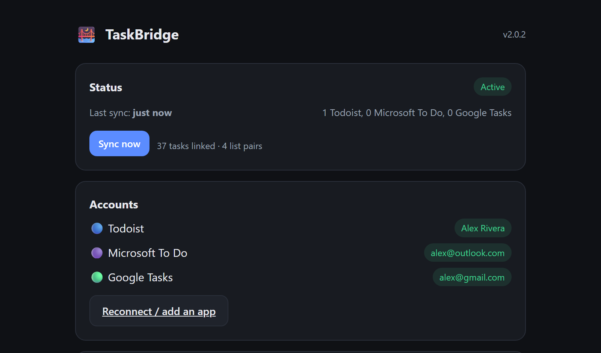

# 🌉 TaskBridge

Self-hosted sync between **Microsoft To Do**, **Todoist**, and **Google Tasks**
— connect any two, or all three. Add or check off a task in one and it shows up
in the others within a minute. One small container, no cloud middleman.

<p align="center"></p>

## What syncs

| | |
|---|---|
| Title, notes, due **date**, completion | ✅ across all connected apps |
| Priority | ✅ as an "important" flag (Todoist P1/P2 ⇄ To Do High importance). Google Tasks has no priority field, so it just won't carry one — the other two still sync it between themselves. |
| Lists ⇄ Projects ⇄ Task lists | ✅ matched by name; the missing side is created on connect. Default/inbox lists always match regardless of what each app calls them. |
| Deleting a task | ✅ deletes it everywhere it's linked |

**Not synced:** time-of-day on due dates (only the date), sub-tasks / checklist
items, recurrence *rules* (a recurring task still syncs its next due date),
labels, reminders, attachments.

**Conflicts** (the same task edited on two sides before a sync): the app set in
Settings wins — default Todoist.

## Quick start (Docker)

```bash
docker run -d --name taskbridge --restart unless-stopped \
  -p 3737:3737 -v taskbridge-data:/data \
  ghcr.io/payam-ghavi/taskbridge:latest
```

or with Compose:

```yaml
services:
  taskbridge:
    image: ghcr.io/payam-ghavi/taskbridge:latest
    restart: unless-stopped
    ports: ["3737:3737"]
    volumes: ["./data:/data"]
```

Then open `http://localhost:3737` and connect at least two apps:

1. **Todoist** — paste an API token (Todoist → Settings → Integrations → Developer).
2. **Microsoft To Do** — click Connect, open the link, type the short code, sign in.
   No Azure account or app registration — it uses Microsoft's public
   "Graph Command Line Tools" client via the device-code flow.
3. **Google Tasks** *(optional)* — Google doesn't offer a shared sign-in like
   Microsoft's, so this one needs a free Google Cloud OAuth app of your own
   first (same pattern Nextcloud/Immich use for Google integrations) — the
   setup page walks through it, about 10 minutes, one time.
4. Pick a sync interval, a conflict rule, and hit **Start syncing**.

Images on `ghcr.io/payam-ghavi/taskbridge` and
[`payamg/taskbridge`](https://hub.docker.com/r/payamg/taskbridge)
(Docker Hub), both `linux/amd64` + `linux/arm64`.

## Install on Umbrel

App Store → **⋯** → **Community App Stores** → add
`https://github.com/payam-ghavi/taskbridge`, then open the TaskBridge store and
install. Same setup flow as above.

## How it works

Every cycle it pulls each connected app's change feed — Todoist's incremental
`sync_token`, Microsoft Graph's per-list delta query, and (since Google Tasks
has neither) a full fetch of each Google list diffed against what's already
linked — reconciles them all against a local SQLite state file, and writes the
differences to every other connected app.

**Echo suppression:** after writing a task it stores the exact value written;
next cycle that write comes back through the source app's own feed, matches,
and is ignored. Real edits don't match, so they propagate. Already-completed
tasks that were never linked are skipped — it never resurrects history.

State (task links, sync cursors, account tokens, your settings) lives in
`/data/state.db`. Back that up and you can move the app anywhere.

## Privacy

Runs entirely on your machine. The only outbound connections are to the APIs of
the apps you connect (`graph.microsoft.com`, `api.todoist.com`,
`tasks.googleapis.com`). Your tokens never leave the container.

## Development

```bash
pip install -r requirements.txt
TASKBRIDGE_DATA=./data PORT=3737 python -m app
```

MIT licensed.
